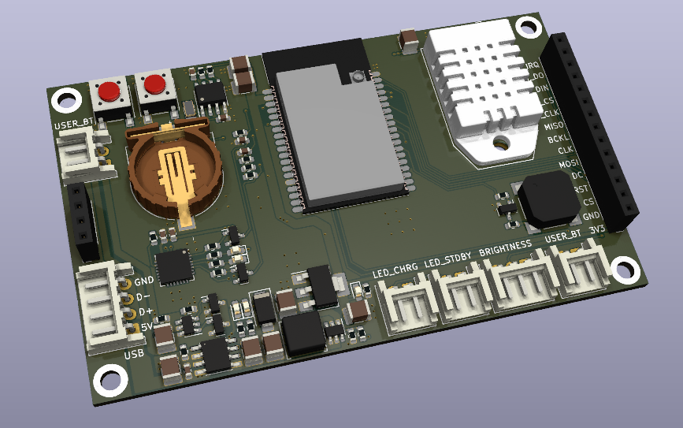
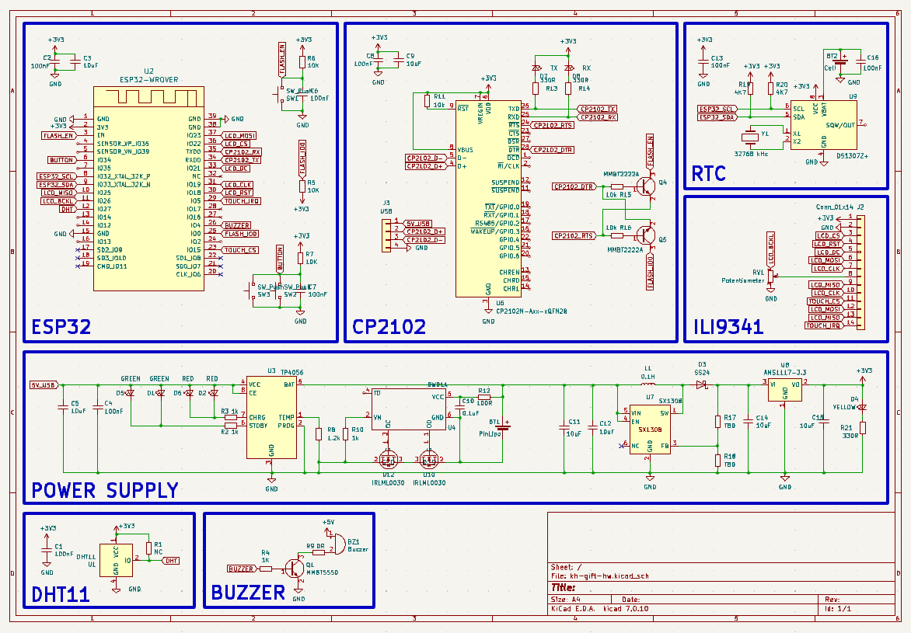
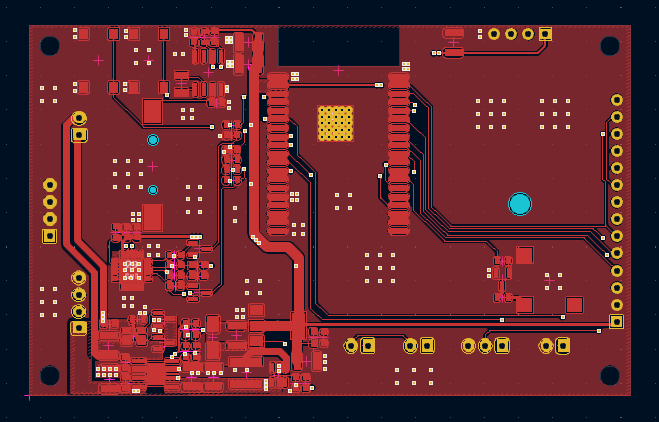
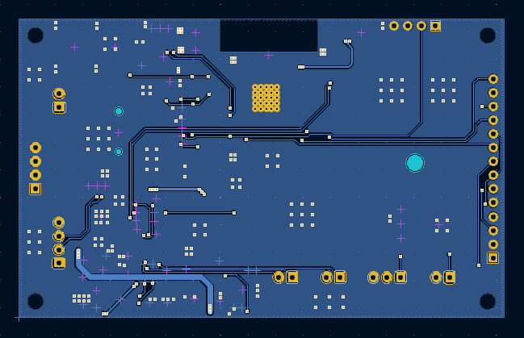
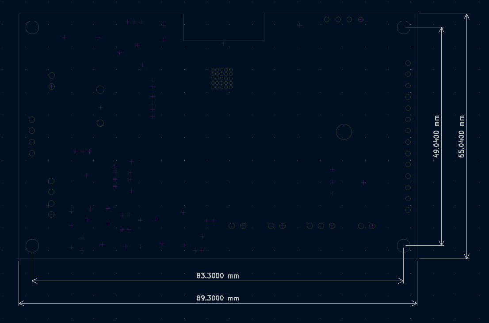
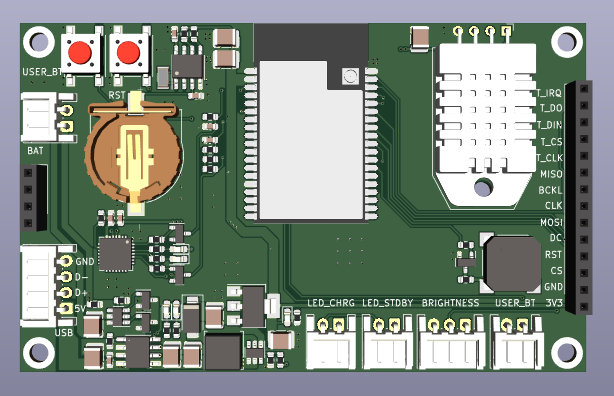
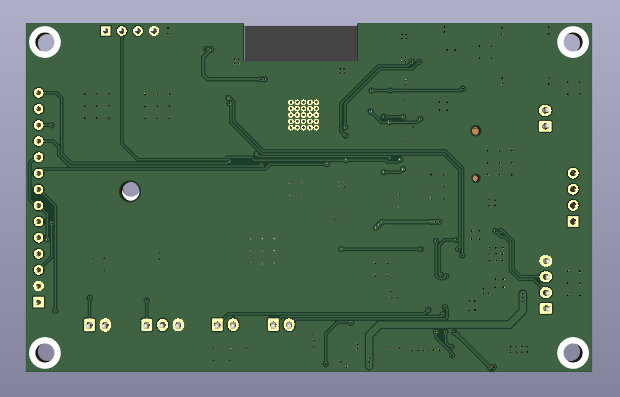

# kh-gift-hw

### 1. Overview

### 2. Specifications

| Items            | Specifications                                    |
| ---------------- | ------------------------------------------------- |
| Power supply     | Pin LiPo 1 cell                                   |
| Microcontroller  | ESP32                                             |
| LEDs and Buttons | LED Charge LED Standby User push button |
| Dimensions       | 89.4 x55 mm Screw hole 83.4 x 49 mm          |

### 3. Hardware design

#### Schematic

#### PCB Top

#### PCB Bot

#### Dimension

#### 3D Top

#### 3D Bot

### 4. Bill of Materials (BOM)

[Download.](assets/BOM/kh-gift-hw.xlsx)

### 5. Gerber

[gerber_kh_gift_hw_v1_0](assets/gerber_kh_gift_hw_v1_0.zip)

[gerber_kh_gift_hw_v2_0](assets/gerber_kh_gift_hw_v2_0.zip)